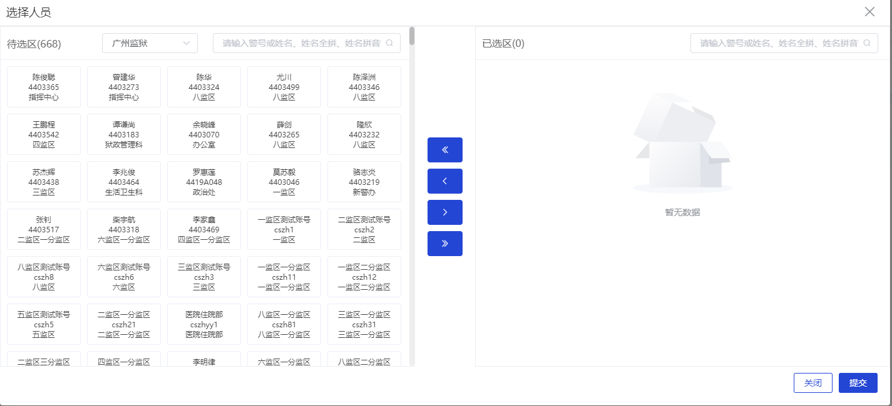
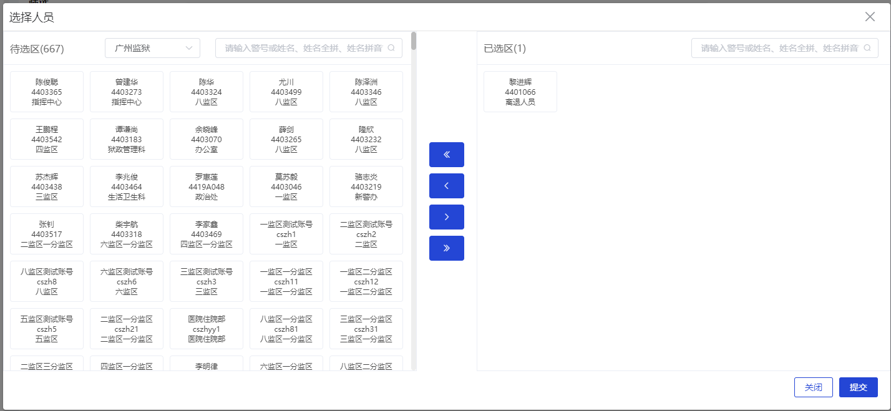

# select-user
跨部门人员选择器

apiUrl.selectAcceptUserName接口返回人员数据格式
```
 res.list = [
  {
    "orgType": 3,
    "mobileOne": "15625280140",
    "code": "422196",
    "orgDutyType": 2,
    "name": "刘德华",
    "pyName": "liudehua",
    "orgFullName": "九监区",
    "id": "1592433894629814274",
    "pyShortName": "ldh",
    "orgid": "159243d691359494146",
    "deptname": "九监区"
  },
  {...}
]
```



